# Pipeline Tìm Kiếm Quán Ăn — Phiên Bản Hiện Tại

> **Cập nhật lần cuối:** 2026-05-24
>
> **File chính phụ trách:** `POST /api/v1/search/recommend` → [`search/router.py`](file:///home/cheems/dev/Smart_Travel_System_Food_Recommend/core_backend/app/domains/search/router.py) → [`search/service.py:process_recommend_query()`](file:///home/cheems/dev/Smart_Travel_System_Food_Recommend/core_backend/app/domains/search/service.py#L42-L169)

---

## Tổng Quan Các Thay Đổi So Với Pipeline Cũ

| # | Thay đổi | Mô tả |
|---|----------|-------|
| 1 | **Thêm hỗ trợ Map Viewport/Radius** | Request mới có `map_center_lat/lng`, `map_north/south/east/west`, `map_radius_km` để tìm kiếm theo vùng nhìn bản đồ |
| 2 | **gRPC + HTTP Fallback** | Toàn bộ giao tiếp Core Backend ↔ AI Engine hỗ trợ gRPC (nếu `ENABLE_GRPC=true`), tự động fallback HTTP khi gRPC lỗi |
| 3 | **TTL Cache cho Gemini** | Kết quả `clean_query_with_gemini()` được cache 1h (max 1000 entries) để tránh gọi lại API trùng lặp |
| 4 | **Emotion Search Mode** | Mode `emotion` bỏ qua user vector combination (giữ nguyên query vector) và thêm bước Sentiment Pre-Ranking trước LambdaMART |
| 5 | **Inline Allergy Filter ở DB-level** | Thêm `apply_inline_allergy_filter()` lọc dị ứng trực tiếp trong SQL query (trước khi lấy candidates), bổ sung cho allergy annotation sau retrieval |
| 6 | **Progressive Spatial Relaxation cho search chính** | Cơ chế nới lỏng bán kính (15km → 30km → 50km) + High Warning Fallback đã có trong pipeline tìm kiếm chính (`recommendation_service.py`), không chỉ riêng group |
| 7 | **Adaptive Distance Decay (Density-Aware)** | Bước mới sau LambdaMART: điều chỉnh `ranking_score` bằng exponential decay theo khoảng cách, scale tự động theo mật độ quán |
| 8 | **Feature Service mở rộng** | Thêm 2 features: `is_open` (trạng thái mở cửa), `tag_match` (khớp tag). Thêm Synonym Boost (cà phê ↔ coffee) |
| 9 | **Dynamic Reason Generation** | `_generate_dynamic_reason()` tự động sinh lý do phong phú hơn: tag match, khoảng cách, rating, sentiment |
| 10 | **Response mở rộng** | Thêm `tags[]`, `sentiment_score`, `sentiment_label`, `sentiment_review_count`, `results_contain_warnings` |

---

## Bước 1 — Frontend gửi Request tới Core Backend

- **File thực thi:** [`search/router.py`](file:///home/cheems/dev/Smart_Travel_System_Food_Recommend/core_backend/app/domains/search/router.py#L34-L45)
- **Endpoint:** `POST /api/v1/search/recommend`

| Thành phần | Chi tiết |
|------------|----------|
| **Input** | JSON body kiểu [`SearchRecommendRequest`](file:///home/cheems/dev/Smart_Travel_System_Food_Recommend/core_backend/app/domains/search/schemas.py#L12-L34) gồm: |
| | • `query` (str): Câu văn tiếng Việt thô, VD: *"Hôm nay trời lạnh, thèm ăn món nóng"* |
| | • `lat`, `lng` (float): Tọa độ GPS hiện tại của người dùng |
| | • `user_id` (str, optional): ID tài khoản (dùng để cá nhân hóa) |
| | • `budget` (int, optional): Ngân sách người dùng nhập (VND). Nếu thiếu → mặc định `50,000 VND` |
| | • `tag_name` (str, optional): Bộ lọc tag cứng, VD: `"phở"`, `"gà"` |
| | • `search_mode` (str): `"basic"` hoặc `"emotion"` (ảnh hưởng tới thuật toán rank) |
| | • `top_k` (int): Số kết quả tối đa, mặc định `24` |
| | • 🆕 `map_center_lat`, `map_center_lng` (float, optional): Tâm bản đồ cho map-view search |
| | • 🆕 `map_north`, `map_south`, `map_east`, `map_west` (float, optional): Viewport bounds của bản đồ |
| | • 🆕 `map_radius_km` (float, optional): Bán kính tìm kiếm theo vòng tròn trên bản đồ |
| **Process** | Router nhận request, khởi tạo `SearchService(ai_client)`, kiểm tra client disconnection, rồi gọi `process_recommend_query()` |
| **Output** | Request được chuyển vào [`SearchService.process_recommend_query()`](file:///home/cheems/dev/Smart_Travel_System_Food_Recommend/core_backend/app/domains/search/service.py#L42-L169) |

---

## Bước 2 — Gọi AI Engine để xử lý ngôn ngữ tự nhiên (NLP)

- **File thực thi:** [`ai_client.py:extract_intent_and_vectorize()`](file:///home/cheems/dev/Smart_Travel_System_Food_Recommend/core_backend/app/services/ai_client.py#L50-L78) → AI Engine `:8001`

### Bước 2a — Gemini làm sạch câu query

| Thành phần | Chi tiết |
|------------|----------|
| **File thực thi** | [`ai_engine/app/nlp/llm_parser.py:clean_query_with_gemini()`](file:///home/cheems/dev/Smart_Travel_System_Food_Recommend/ai_engine/app/nlp/llm_parser.py#L78-L118) |
| **Input** | Câu văn thô từ người dùng, VD: *"Hôm nay trời lạnh, thèm ăn món nóng"* |
| **Process** | 1. 🆕 Kiểm tra **TTL Cache** (max 1000 items, TTL 1h) — nếu query đã được xử lý trước đó → trả về kết quả cached ngay lập tức |
| | 2. Gửi câu văn tới Google Gemini API với `system_instruction` tách riêng (tránh prompt injection) |
| | 3. Gemini dịch ngữ cảnh mơ hồ thành danh sách tên món ăn cụ thể. Loại bỏ từ khóa cảm xúc, thời tiết, ngân sách |
| | 4. Kết quả trả về dạng JSON `{"cleaned_query": "..."}` được parse và cache lại |
| **Output** | `cleaned_query` (str), VD: *"lẩu thái, đồ nướng, phở bò, bún bò huế, cháo sườn, bánh canh"* |
| **Fallback** | Nếu Gemini API lỗi hoặc không có `GEMINI_API_KEY` → giữ nguyên câu văn gốc |

### Bước 2b — Tách từ tiếng Việt và sinh Vector Embedding

| Thành phần | Chi tiết |
|------------|----------|
| **File thực thi** | [`ai_engine/app/nlp/service.py:generate_mean_pooled_embedding()`](file:///home/cheems/dev/Smart_Travel_System_Food_Recommend/ai_engine/app/nlp/service.py#L26-L45) |
| **Input** | `cleaned_query` từ bước 2a |
| **Process** | 1. Gọi `underthesea.word_tokenize()` để tách từ tiếng Việt |
| | 2. Đưa văn bản đã tách từ vào model `vietnamese-bi-encoder` (SentenceTransformer) |
| | 3. Encode trực tiếp (model tự thực hiện mean pooling) |
| **Output** | `vector` — danh sách 768 số thực (float), đại diện cho ý nghĩa của câu query |
| **Fallback** | Nếu model không load được → sinh vector ngẫu nhiên nhỏ (near-zero `[-0.05, 0.05]`) bằng hash deterministic |

### Giao tiếp Core Backend ↔ AI Engine (Bước 2 tổng thể)

| Thành phần | Chi tiết |
|------------|----------|
| **File thực thi** | [`ai_client.py:AIServiceClient.extract_intent_and_vectorize()`](file:///home/cheems/dev/Smart_Travel_System_Food_Recommend/core_backend/app/services/ai_client.py#L50-L78) |
| **Process** | 🆕 Nếu `ENABLE_GRPC=true` → gọi qua gRPC ([`grpc_client.py`](file:///home/cheems/dev/Smart_Travel_System_Food_Recommend/core_backend/app/services/grpc_client.py)). Nếu gRPC lỗi → tự động fallback HTTP POST tới `/api/v1/nlp/extract-intent` |
| **Output** | `AIResponseData` gồm `vector` (768 chiều) + `cleaned_query` (str) gửi trả về Core Backend |

---

## Bước 3 — Kết hợp Vector người dùng + Vector query (Cá nhân hóa)

| Thành phần | Chi tiết |
|------------|----------|
| **File thực thi** | [`recommendation_service.py:recommend()`](file:///home/cheems/dev/Smart_Travel_System_Food_Recommend/core_backend/app/services/recommendation_service.py#L24-L60) |
| **Input** | `query_vector` (768d) + `user_vector` (768d, lấy từ DB theo `user_id`) + `search_mode` |
| **Process** | 🆕 Kiểm tra `search_mode`: |
| | • Nếu `search_mode = "emotion"` → **bỏ qua** user vector, giữ nguyên query vector (ý định cảm xúc tức thời không bị lệch bởi sở thích lâu dài) |
| | • Nếu `search_mode = "basic"` và cả hai vector tồn tại → kết hợp theo tỷ lệ **85% query + 15% user** |
| | • Nếu chỉ có user vector (không có query vector) → dùng nguyên user vector |
| **Output** | `final_vector` (768d) — vector tìm kiếm cuối cùng |

---

## Bước 4 — Truy xuất ứng viên từ Database (Retrieval)

| Thành phần | Chi tiết |
|------------|----------|
| **File thực thi** | [`retrieval_service.py:RetrievalService.get_candidates()`](file:///home/cheems/dev/Smart_Travel_System_Food_Recommend/core_backend/app/domains/ranking/retrieval_service.py#L72-L244) |
| **Input** | `final_vector`, `budget`, `query_text`, `cleaned_query`, `tag_name`, `viewport_bounds`, `map_center`, `map_radius_km`, `user_allergies` |
| **Process (theo thứ tự):** | |
| | 1. **Lọc theo trạng thái:** Chỉ lấy quán có `is_active = True` |
| | 2. 🆕 **Inline Allergy Filter (DB-level):** Nếu `user_allergies` tồn tại → gọi [`apply_inline_allergy_filter()`](file:///home/cheems/dev/Smart_Travel_System_Food_Recommend/core_backend/app/services/allergy_filter.py#L58-L88) để loại bỏ quán mà **tất cả** món đều chứa allergen (quán có ít nhất 1 món an toàn vẫn giữ) |
| | 3. 🆕 **Lọc theo Viewport/Radius:** Nếu có `viewport_bounds` → filter theo bounding box viewport. Nếu có `map_center` + `map_radius_km` → filter theo bán kính bounding box. Nếu không có → không giới hạn không gian |
| | 4. **Lọc theo ngân sách (Budget filter):** Chỉ lấy quán có `price_range` (min hoặc max) ≤ `budget`. Quán không có giá → vẫn được giữ lại |
| | 5. **Lọc món chay (Negative filter):** Nếu query không chứa từ khóa "chay/vegetarian" nhưng chứa từ khóa thức ăn cụ thể → loại bỏ quán thuần chay (`is_vegetarian = True`) |
| | 6. **Lọc/Boost theo Tag (Tag filter):** Nếu có `tag_name` hoặc query chứa từ khóa map được (VD: "gà" → tag `"gà"`) → ưu tiên quán có tag đó. Nếu quán có tag match ≥ 3 quán → áp dụng hard filter; nếu < 3 → dùng boost (giảm `distance` thêm `0.3`) |
| | 7. **Semantic Ordering bằng pgvector:** `ORDER BY embedding_vector <=> final_vector` (cosine distance, thấp = giống nhất), chỉ lấy quán có `embedding_vector NOT NULL`. Lấy tối đa `500` ứng viên |
| | 8. **Exact keyword match trên DishModel:** Tìm các quán có tên món khớp từng từ trong `cleaned_query` → boost `distance - 0.25` |
| | 9. **Vector search trên DishModel:** Cosine distance giữa `final_vector` và `dish.embedding_vector`, lấy top 30 dish có `distance < 0.7` → boost quán tương ứng thêm `distance - 0.15` |
| | 10. **Sắp xếp lại** toàn bộ ứng viên theo `distance` tăng dần |
| | 11. 🆕 **Post-filter Haversine:** Nếu có `map_center` + `map_radius_km` → lọc lại bằng khoảng cách Haversine chính xác (loại bỏ các quán nằm ngoài bán kính do bounding box xấp xỉ) |
| **Output** | Danh sách tối đa `500` `RestaurantModel` đã sắp xếp theo mức độ phù hợp ngữ nghĩa |
| **Fallback** | Nếu không có `query_vector` → fallback ORDER BY `rating_avg DESC` |

---

## Bước 4.5 — Progressive Spatial Relaxation (Nới lỏng bán kính khi thiếu kết quả)

> 🆕 **Bước mới** — Chỉ kích hoạt khi user có `user_allergies` VÀ có `map_radius_km`.

| Thành phần | Chi tiết |
|------------|----------|
| **File thực thi** | [`recommendation_service.py:recommend()`](file:///home/cheems/dev/Smart_Travel_System_Food_Recommend/core_backend/app/services/recommendation_service.py#L66-L119) |
| **Input** | `raw_candidates` từ Bước 4, `user_allergies`, `map_radius_km` |
| **Process** | |
| | **Giai đoạn 1 — Nới lỏng bán kính:** Nếu kết quả < 16 sau khi lọc dị ứng, tự động mở rộng bán kính: `map_radius_km` → `15km` → `30km` → `50km`. Mỗi lần mở rộng, gọi lại `get_candidates()` với bán kính mới (vẫn giữ allergy filter). Dừng ngay khi đạt ≥ 16 kết quả |
| | **Giai đoạn 2 — High Warning Fallback:** Nếu đã mở rộng đến 50km mà vẫn < 16 → gọi lại `get_candidates()` **KHÔNG CÓ** allergy filter ở bán kính lớn nhất. Nếu đạt ≥ 16 → dùng kết quả unfiltered và set `results_contain_warnings = true` |
| **Output** | `raw_candidates` (có thể mở rộng) + cờ `results_contain_warnings` |
| **Fallback** | Nếu không có `user_allergies` hoặc không có `map_radius_km` → bỏ qua bước này, dùng truy vấn đơn |

---

## Bước 5 — Gắn nhãn cảnh báo dị ứng (Allergy Annotation)

| Thành phần | Chi tiết |
|------------|----------|
| **File thực thi** | [`allergy_filter.py:annotate_allergy()`](file:///home/cheems/dev/Smart_Travel_System_Food_Recommend/core_backend/app/services/allergy_filter.py#L196-L245) |
| **Input** | Danh sách quán (lên tới 500) + `user_allergies` (lấy từ DB theo `user_id`) + `allergen_map` + `dish_detail_map` |
| **Process** | 1. Pre-fetch allergens: [`fetch_allergen_map()`](file:///home/cheems/dev/Smart_Travel_System_Food_Recommend/core_backend/app/services/allergy_filter.py#L113-L133) + [`fetch_dish_detail_map()`](file:///home/cheems/dev/Smart_Travel_System_Food_Recommend/core_backend/app/services/allergy_filter.py#L173-L194) cho tất cả restaurant IDs |
| | 2. Với mỗi quán, kiểm tra từng món ăn trong danh sách `DishModel.allergens` xem có chứa thành phần người dùng bị dị ứng không (tra từ `ALLERGY_MAP` — mapping đa ngôn ngữ VD: "đậu phộng" ↔ "peanut" ↔ "satay") |
| | 3. **Không loại bỏ quán**, chỉ gắn thêm trường `allergen_warning` vào từng quán |
| **Output** | Toàn bộ quán, mỗi quán có thêm trường `allergen_warning` (danh sách `{dish_name, matched_allergens}` hoặc `None` nếu an toàn) + `flagged_count` (số quán có cảnh báo) |

---

## Bước 5.5 — Sentiment Pre-Ranking (chỉ Emotion Search Mode)

> 🆕 **Bước mới** — Chỉ kích hoạt khi `search_mode = "emotion"`.

| Thành phần | Chi tiết |
|------------|----------|
| **File thực thi** | [`recommendation_service.py:_apply_sentiment_search_boost()`](file:///home/cheems/dev/Smart_Travel_System_Food_Recommend/core_backend/app/services/recommendation_service.py#L278-L312) |
| **Input** | `safe_candidates` sau khi allergy annotation |
| **Process** | Tính `sentiment_search_score` cho mỗi quán bằng weighted sum: |
| | • `60%` semantic_score (1 - cosine_distance) |
| | • `25%` sentiment_score (normalized từ review) |
| | • `10%` review_confidence (log-scale của total_reviews) |
| | • `5%` rating_score (rating_avg / 5.0) |
| | Sắp xếp candidates theo `sentiment_search_score` giảm dần |
| **Output** | Danh sách candidates đã sắp xếp lại theo trọng số sentiment (trước khi vào LambdaMART) |

---

## Bước 6 — Xây dựng Feature Vector cho LambdaMART

| Thành phần | Chi tiết |
|------------|----------|
| **File thực thi** | [`feature_service.py:FeatureService.build_integer_features()`](file:///home/cheems/dev/Smart_Travel_System_Food_Recommend/core_backend/app/domains/ranking/feature_service.py#L27-L108) |
| **Input** | Tối đa `50` quán tốt nhất (đã qua bước cosine distance ≤ `0.80`) + `user_lat`, `user_lng`, `budget`, `query_text` |
| **Process** | Với mỗi quán, tính **9 đặc trưng** (đều là số nguyên): |
| | • `similarity_score`: `(1 - cosine_distance) × 100`, sau đó: |
| |   — 🆕 Cộng `+40` nếu tên quán khớp synonym group (VD: "cà phê" ↔ "coffee" ↔ "cafe") |
| |   — Cộng `+25` nếu từ khóa query xuất hiện trong tên quán (loại trừ stopwords: "tìm", "quán", "ăn"...) |
| | • `rating`: `rating_avg × 100` (VD: 4.5 sao → 450) |
| | • `sentiment_score`: Điểm sentiment chuẩn hóa `[-1, 1]` × 100 |
| | • `distance_m`: Khoảng cách Haversine từ GPS người dùng đến quán (mét, int). 🆕 Gắn ngược lại vào candidate (`setattr(r, "distance_m", dist_m)`) để dùng cho Distance Decay ở Bước 7a |
| | • `price_normalized`: `(giá_max / budget) × 100` |
| | • `review_count`: Tổng số đánh giá |
| | • 🆕 `is_open`: `1` nếu quán đang mở cửa (`is_open_now`), `0` nếu không |
| | • 🆕 `tag_match`: `1` nếu quán có tag khớp, `0` nếu không |
| **Output** | Danh sách dict `[{"res_id": ..., "rating": 450, "distance_m": 1200, "is_open": 1, "tag_match": 1, ...}]` |

---

## Bước 7 — Rerank bằng LambdaMART (AI Engine)

| Thành phần | Chi tiết |
|------------|----------|
| **File thực thi** | [`recommendation_service.py`](file:///home/cheems/dev/Smart_Travel_System_Food_Recommend/core_backend/app/services/recommendation_service.py#L144-L207) gọi → [`ai_engine/app/ranking/lambdamart.py:LambdaMARTRanker.rank()`](file:///home/cheems/dev/Smart_Travel_System_Food_Recommend/ai_engine/app/ranking/lambdamart.py#L71-L102) |
| **Input** | Danh sách tối đa 50 feature dict từ Bước 6 + `top_k` |
| **Process** | 1. 🆕 Gọi qua gRPC (nếu `ENABLE_GRPC=true`) hoặc HTTP POST `ai_engine:8001/api/v1/ml/rank` |
| | 2. Chuyển feature dict thành ma trận float32 `(N, 6)` theo thứ tự: `similarity_score`, `rating_norm`, `sentiment_norm`, `distance_log`, `price_clipped`, `review_log` |
| | 3. LightGBM Booster (LambdaMART objective) chạy `predict()` → sinh điểm số cho từng quán |
| | 4. Sắp xếp theo điểm giảm dần, trả về danh sách `ranked_ids` và `scores` |
| | **Trọng số huấn luyện:** `similarity` (45%) > `rating` (20%) > `sentiment` (15%) > `price` (-8%) > `distance` (-8%) > `review_count` (4%) |
| | 5. Merge reranked candidates vào danh sách ban đầu (giữ lại candidates bị miss) |
| **Output** | `ranked_ids` (danh sách ID đã sắp xếp) + `scores` (điểm của từng quán), gắn `ranking_score` lên mỗi candidate |
| **Fallback** | Nếu LambdaMART lỗi (timeout hoặc exception) → giữ nguyên thứ tự cosine distance từ Bước 4. Nếu < 3 ứng viên đạt chuẩn (distance ≤ 0.80) → bỏ qua rerank |

---

## Bước 7a — Adaptive Distance Decay (Density-Aware)

> 🆕 **Bước mới** — Áp dụng sau LambdaMART rerank.

| Thành phần | Chi tiết |
|------------|----------|
| **File thực thi** | [`recommendation_service.py:_apply_distance_decay()`](file:///home/cheems/dev/Smart_Travel_System_Food_Recommend/core_backend/app/services/recommendation_service.py#L221-L275) |
| **Input** | Danh sách candidates đã có `ranking_score` + `distance_m` |
| **Process** | 1. **Nhận diện mật độ:** Đếm số quán trong bán kính 2km |
| | 2. **Chọn `decay_scale` theo mật độ:** |
| |   — Vùng đông (≥ 10 quán gần): `decay_scale = 2.0` → phạt mạnh quán xa |
| |   — Vùng trung bình (≥ 5 quán): `decay_scale = 4.0` → phạt vừa phải |
| |   — Vùng thưa (< 5 quán): `decay_scale = 8.0` → tha cho quán xa |
| | 3. **Áp dụng decay:** `final_score = ranking_score × exp(-dist_km / decay_scale)` |
| | 4. **Sắp xếp lại** theo `ranking_score` giảm dần (quán không có ranking_score xuống cuối) |
| **Output** | Danh sách candidates đã điều chỉnh thứ tự theo khoảng cách + mật độ. Không loại bỏ kết quả nào |

---

## Bước 8 — Format kết quả + Tính Match%

| Thành phần | Chi tiết |
|------------|----------|
| **File thực thi** | [`search/service.py:process_recommend_query()`](file:///home/cheems/dev/Smart_Travel_System_Food_Recommend/core_backend/app/domains/search/service.py#L86-L119) + [`_map_to_recommend_result()`](file:///home/cheems/dev/Smart_Travel_System_Food_Recommend/core_backend/app/domains/search/service.py#L236-L281) |
| **Input** | `top_k` (mặc định 24) quán đầu sau rerank + `ranking_score` của từng quán |
| **Process** | 1. Lấy `top_k = 24` quán đầu từ danh sách đã rerank |
| | 2. Tính **Match%**: normalize `ranking_score` vào khoảng `[70%, 98%]` theo min-max scaling. Nếu không có `ranking_score` → dùng cosine similarity, loại bỏ quán có match < 57% |
| | 3. Với mỗi quán, gọi `_map_to_recommend_result()` để tính: |
| |   — `dist`: Khoảng cách Haversine từ GPS người dùng (hiển thị dạng `"1.2 km"`) |
| |   — `price`: Format khoảng giá (VD: `"50000-100000"` → `"50k - 100k"`) |
| |   — 🆕 `reason`: Sinh lý do tự động bằng [`_generate_dynamic_reason()`](file:///home/cheems/dev/Smart_Travel_System_Food_Recommend/core_backend/app/domains/search/service.py#L283-L315): tag match → "Có món Gà", dist < 1.5km → "Rất gần bạn", rating ≥ 4.5 → "Đánh giá cao", sentiment ≥ 0.35 → "Review tích cực" |
| |   — 🆕 `tags`: Danh sách tag phân loại của nhà hàng |
| |   — 🆕 `sentiment_score`, `sentiment_label`: Chuẩn hóa từ [`review_sentiment.py`](file:///home/cheems/dev/Smart_Travel_System_Food_Recommend/core_backend/app/services/review_sentiment.py) |
| |   — 🆕 `sentiment_review_count`: Số review đại diện |
| |   — `allergen_warning`: Copy nguyên từ Bước 5 |
| **Output** | Danh sách [`RecommendResult`](file:///home/cheems/dev/Smart_Travel_System_Food_Recommend/core_backend/app/domains/search/schemas.py#L41-L76) (tối đa 24 quán) |

---

## Bước 9 — Lưu Session vào Database

| Thành phần | Chi tiết |
|------------|----------|
| **File thực thi** | [`search/service.py:process_recommend_query()`](file:///home/cheems/dev/Smart_Travel_System_Food_Recommend/core_backend/app/domains/search/service.py#L123-L156) → `db.add(SearchSession(...))` |
| **Input** | `results` + metadata (`query`, `lat`, `lng`, `budget`, `fallback_applied`, ...) |
| **Process** | Tạo object [`SearchSession`](file:///home/cheems/dev/Smart_Travel_System_Food_Recommend/core_backend/app/domains/search/models.py#L11-L29) lưu toàn bộ kết quả dạng JSONB vào bảng `search_sessions`. Encode `UUID` sang `shortuuid` (22 ký tự) làm `session_id`. 🆕 JSONB bao gồm cả `results_contain_warnings` |
| **Output** | `session_id` (short UUID, VD: `"aB3xY9..."`) được lưu DB và trả về cho Frontend |

---

## Bước 10 — Trả Response về Frontend

| Thành phần | Chi tiết |
|------------|----------|
| **File thực thi** | [`search/service.py`](file:///home/cheems/dev/Smart_Travel_System_Food_Recommend/core_backend/app/domains/search/service.py#L158-L169) |
| **Output** | [`SessionCreateResponse`](file:///home/cheems/dev/Smart_Travel_System_Food_Recommend/core_backend/app/domains/search/schemas.py#L128-L138) gồm: |
| | • `session_id`: Short UUID để Frontend navigate đến trang kết quả |
| | • `results`: Danh sách tối đa `24` `RecommendResult`, mỗi phần tử gồm: `id`, `name`, `match` (%), `dist` (km), `distance_km` (float), `price`, `rating`, `reason`, `img`, `total_reviews`, `google_maps_url`, `allergen_warning`, `is_vegetarian`, 🆕 `tags[]`, 🆕 `sentiment_score`, 🆕 `sentiment_label`, 🆕 `sentiment_review_count` |
| | • `fallback_applied`, `fallback_reason`, `applied_budget`, `filtered_out_count`, `allergen_flagged_count`, `warning` |
| | • 🆕 `results_contain_warnings`: `true` nếu kết quả chứa quán chưa lọc dị ứng (chế độ High Warning Fallback) |

---

## Sơ đồ luồng tổng quan

```mermaid
flowchart TD
    A["🖥️ Frontend<br/>POST /api/v1/search/recommend"] --> B["🔌 Router<br/>search/router.py"]
    B --> C["📦 SearchService<br/>process_recommend_query()"]

    C --> D["🤖 AI Engine<br/>extract_intent_and_vectorize()"]
    D --> D1["Gemini LLM<br/>clean_query (+ TTL Cache)"]
    D1 --> D2["PhoBERT<br/>generate_embedding (768d)"]
    D2 --> E["🔀 Vector Combination<br/>85% query + 15% user<br/>(skip nếu emotion mode)"]

    E --> F["🗄️ Retrieval Service<br/>get_candidates()"]
    F --> F1["Inline Allergy Filter (DB)"]
    F1 --> F2["Budget + Tag + Vegetarian Filter"]
    F2 --> F3["pgvector Cosine Search<br/>+ Dish Match Boost"]
    F3 --> F4["Post-filter Haversine"]

    F4 --> G{"Đủ ≥ 16<br/>kết quả?"}
    G -- "Có" --> H
    G -- "Không & có allergy" --> G1["Progressive Spatial<br/>Relaxation<br/>15km → 30km → 50km"]
    G1 --> G2{"Đủ ≥ 16?"}
    G2 -- "Có" --> H
    G2 -- "Không" --> G3["High Warning Fallback<br/>Bỏ allergy filter<br/>results_contain_warnings=true"]
    G3 --> H

    H["🏷️ Allergy Annotation<br/>annotate_allergy()"]
    H --> I{"search_mode<br/>= emotion?"}
    I -- "Có" --> I1["Sentiment Pre-Ranking<br/>_apply_sentiment_search_boost()"]
    I1 --> J
    I -- "Không" --> J

    J["📊 Feature Service<br/>build_integer_features()<br/>9 features"]
    J --> K["🏆 LambdaMART Rerank<br/>gRPC/HTTP → AI Engine"]
    K --> L["📏 Distance Decay<br/>Density-Aware<br/>_apply_distance_decay()"]

    L --> M["✨ Format Results<br/>Match% + Reason + Sentiment"]
    M --> N["💾 Save Session<br/>JSONB → search_sessions"]
    N --> O["📤 Response<br/>SessionCreateResponse<br/>session_id + results"]
```



---

## Về Hành Vi Khi Không Có Kết Quả / Kích Hoạt Fallback (Quy trình dị ứng)

> **Nguyên tắc cốt lõi:** Dị ứng là vấn đề an toàn sức khỏe tuyệt đối — hệ thống KHÔNG được phép đánh đổi sự an toàn để lấy số lượng kết quả hiển thị.

### Cơ chế hiện tại: Progressive Spatial Relaxation + High Warning Fallback

```
Kết quả sau lọc dị ứng < 16 quán?
│
├── Bước 1: Mở rộng bán kính (giữ allergy filter)
│   map_radius_km → 15km → 30km → 50km
│   └── Đủ ≥ 16? → Dùng kết quả an toàn ✅
│
└── Bước 2: High Warning Fallback (chỉ khi Bước 1 thất bại)
    Gọi lại get_candidates() KHÔNG CÓ allergy filter
    ├── results_contain_warnings = true
    ├── allergen_warning gắn trên từng quán cụ thể
    └── Frontend hiển thị cảnh báo rõ ràng ⚠️
```

**Điểm khác biệt so với pipeline cũ:**
- Pipeline cũ **không có** Progressive Spatial Relaxation cho search chính (chỉ có cho group recommendations)
- Pipeline hiện tại đã tích hợp cả 2 giai đoạn (mở rộng không gian + fallback cảnh báo cao) trực tiếp trong [`recommendation_service.py`](file:///home/cheems/dev/Smart_Travel_System_Food_Recommend/core_backend/app/services/recommendation_service.py#L66-L119)
- 🆕 Thêm **Inline Allergy Filter ở DB-level** (Bước 4) giúp loại bỏ sớm quán 100% nguy hiểm trước khi retrieval, giảm tải cho annotation ở Bước 5
