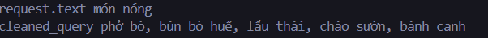
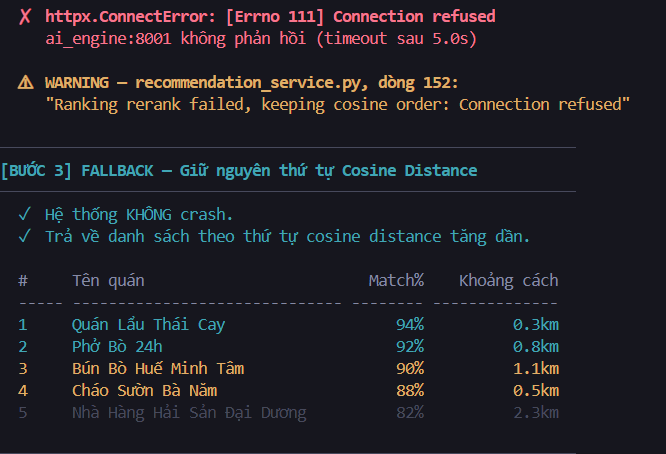

# Wanderbite
## FINAL PRESENTATION

**GVHD:** TS.Bùi Văn Thạch, ThS.Lê Đức Khoan

---

# Mục lục

- Nhắc lại bài toán
- Luồng xử lí của hệ thống
- Tính năng chính
- Kiểm thử
- Đánh giá - Cải tiến
- Demo dự án qua video
---

# Nhắc lại bài toán
> Hệ thống gợi ý quán ăn cho khách du lịch, sử dụng AI để hiểu câu tìm kiếm tiếng Việt. Cá nhân hóa kết quả theo người dùng.
---

# Nhắc lại bài toán
**Bài toán con**
- Hiểu ngôn ngữ tự nhiên tiếng Việt
- Gợi ý đa tiêu chí 
- Xếp hạng thông minh 
---

# Nhắc lại bài toán
## ví dụ
Người dùng nhập vào thanh tìm kiếm
> "Hôm nay trời lạnh, thèm ăn món nóng."

---

# Nhắc lại bài toán

* **Input:**
  - Câu truy vấn người dùng.
  - Ngữ cảnh người dùng: tọa độ GPS.
  - Hồ sơ cá nhân: dị ứng, sở thích, khẩu vị, ngân sách.
* **Output:**
  - Top N quán ăn phù hợp đã được sắp xếp
  - Thông tin chi tiết mỗi quán (khoảng cách, điểm đánh giá, danh sách món, giá)
  - Điểm số đánh giá mức độ phù hợp
---
# Nhắc lại bài toán

**Ràng buộc:**
- Tối thiểu trả về 16 kết quả cho người dùng
- Tốc độ phản hồi trong khoảng 5 giây

---

# Luồng xử lí của hệ thống
1. **Nhận input**: câu văn tiếng Việt, tọa độ GPS, ID người dùng, ngân sách, chế độ tìm kiếm (bình thường hoặc cảm xúc)
2. Làm sạch câu truy vấn: nhận câu văn, sử dụng mô hình gemini dịch ngữ cảnh mơ hồ thành danh sách tên món ăn cụ thể.
3. Tách từ tiếng Việt bằng mô hình **underthesea** 
4. Tạo vector 768 chiều bằng mô hình **vietnamese-bi-encoder**

---

# Luồng xử lí của hệ thống
5. Kết hợp vector người dùng và vector câu truy vấn (theo tỉ lệ 85% truy vấn hiện tại-15% sở thích người dùng)
6. Lọc quán đang hoạt động
7. Lọc theo ngân sách (lấy quán có khoảng giá <= ngân sách)
8. Lọc món chay (nếu truy vấn không chứa từ khóa chay -> loại quán thuần chay)
---

# Luồng xử lí của hệ thống
9. Lọc theo tags
10. Sắp xếp theo khoảng cách cosine (lấy tối đa 500 quán)
11. Tăng điểm cho quán có tên khớp với truy vấn
12. Tìm kiếm vector trên danh sách **món ăn**
13. Sắp xếp lại theo khoảng cách cosine tăng dần
---

# Luồng xử lí của hệ thống
14. Gán nhãn cảnh báo dị ứng
15. Xây dựng đặc trưng xếp hạng cho mỗi quán (6 đặc trưng: `similarity_score`, `rating_norm`, `sentiment_norm`, `distance_log`, `price_clipped`, `review_log`)
16. Sắp xếp theo cảm xúc (tùy chọn)
17. Sắp xếp lại bằng **LambdaMART**
18. Phân rã khoảng cách + nhận diện mật độ quán ăn

19. Format kết quả + tính điểm phù hợp %
20. **Output**: trả về top 16 quán đã sắp xếp.

---

# Flowchart

---
# Tính năng chính

* Tìm kiếm quán ăn
- Lưu, tạo bộ sưu tập, xem lại lịch sử tìm kiếm
* Hồ sơ cá nhân 
- Cảnh báo dị ứng
---

# Kiểm thử

> Câu truy vấn sau khi làm sạch bằng gemini

---

# Kiểm thử
> Thứ tự kết quả khi mô hình xếp hạng lambdaMART bị lỗi

---

# Đánh giá - Cải tiến
## Đánh giá
- **Khoảng cách** từ người dùng đến quán ăn đang tính theo đường chim bay.
- Phụ thuộc vào mô hình **gemini API**
- **Dị ứng** chỉ hỗ trợ 8 loại cố định, không cho phép người dùng tự thêm
---

# Đánh giá - Cải tiến
## Cải tiến
- **Khoảng cách** từ người dùng đến quán ăn theo tuyến đường
-  Tích hợp cổng **API OpenRouter** để linh hoạt chuyển đổi giữa nhiều mô hình AI 
- **Dị ứng** cho phép người dùng tự thêm
---

# Demo dự án qua video

---

# Kết thúc
